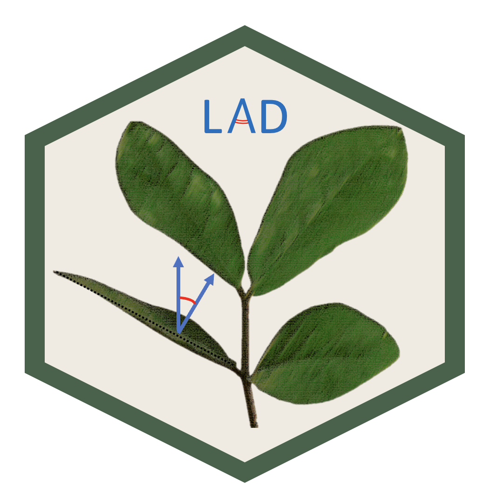

<!-- README.md is generated from README.Rmd. Please edit that file -->



# LAD: an R package to estimate leaf angle distribution from measured leaf inclination angles

# Introduction

Leaf angle distribution (LAD) is an important factor for characterizing
the optical features of vegetation canopies ([Ross
1981](https://link.springer.com/book/10.1007/978-94-009-8647-3)). It
influences several processes such as photosynthesis, evapotranspiration,
spectral reflectance and absorptance ([Vicari et al.
2019](https://doi.org/10.1016/j.agrformet.2018.10.021)).  LAD influence
on radiation transmission is also described by the leaf projection
function (also known G-function), which is the projection coefficient
function of unit foliage area on a plane perpendicular to the viewing
direction ([Ross
1981](https://link.springer.com/book/10.1007/978-94-009-8647-3)). Both
parameters are therefore crucial to indirectly estimate Leaf Area Index
(LAI) from gap fraction or radiation trasmission measurements.  
Despite its importance, LAD is one of the most poorly characterized
parameters due to the difficulty of directly measure leaf inclination
angles, particularly in tall trees . As alternative to direct manual
measurements, [Ryu et al.
(2010)](https://doi.org/10.1016/j.agrformet.2009.08.007) proposed a
robust and simple leveled photographic method to measure leaf
inclination angles, which was proven comparable to manual clinometer
measurements ([Pisek et al.
(2011)](https://doi.org/10.1016/j.agrformet.2012.10.011)).  
Using this leveled photographic method, some dataset of leaf inclination
angle distributions have been compiled by some authors ([Pisek et al.
2013](https://doi.org/10.1016/j.agrformet.2012.10.011); [Raabe et al.
2015](https://doi.org/10.1016/j.agrformet.2015.07.008); [Chianucci et
al. 2018](https://doi.org/10.1007/s13595-018-0730-x); [Pisek and Adamson
2020](https://doi.org/10.1016/j.dib.2020.106391)).  

In this article we presented “LAD”, an R package to calculate the Leaf
angle distribution (LAD) function and the G-function from measured leaf
inclination angles.

# Basic theory

The method proposed by [Ryu et al.
(2010)](https://doi.org/10.1016/j.agrformet.2009.08.007) consists of
acquiring leveled images of the canopy using a digital camera. As some
species may display phototropism, leaves shall be measured in all the
azimuth directions and along the vertical profile of the surrounding
canopy. Crowns of trees can be observed using towers, extendable poles,
ladder, nearby tall buildings, or unmanned aerial vehicles ([McNeil et
al. 2016](https://doi.org/10.1016/j.agrformet.2015.12.058)). The
measurement of leaf inclination angle requires the identification of the
leaf plane, from which the leaf normal is measured (Fig. 1). For this
reason, the leaves must be selected from those oriented approximately
parallel to the viewing direction of the camera (i.e., the leaves shown
as a line in the image, Fig. 1), avoiding bended leaves to be measured.

<figure>

  

<figcaption align="left">

<b>Figure 1. Example of leaf inclination angle measurements from leveled
photography. The measure of leaf inclination angle requires the
identification of a hypothetical leaf plane xy, from which the leaf
surface normal $\hat{N}$ is calculated with respect to the zenith (z).
In a 2-D space, such as a digital image, the only measurable leaf normal
is that oriented perpendicular to the camera viewing direction, since
the leaf inclination plane is parallel to the leaves (the red dashed
line on the left side of the figure). From [Chianucci et al.
2018](https://doi.org/10.1007/s13595-018-0730-x), modified </b>

</figcaption>
</figure>

Once a reliable set of leaf inclination angles measurements $\theta_L$
are taken (a minimum of 75 measurements per species are recommended by
[Pisek et al. (2013)](https://doi.org/10.1016/j.agrformet.2012.10.011)),
two parameters $\mu,\nu$ are derived for fitting a Beta distribution:

$\mu=(1-\overline{t})(\frac{\sigma_0^2}{\sigma_t^2}-1)$  

$\nu=\overline{t}(\frac{\sigma_0^2}{\sigma_t^2}-1)$

where $\sigma_0^2$ and $\sigma_t^2$ are the maximum standard deviation
and variance of t, respectively, and are calculated following [Wang et
al.(2007)](https://doi.org/10.1016/j.agrformet.2006.12.003):  

$\sigma_0^2=\overline{t}(1-\overline{t})$  

$\sigma_t^2=var(t)$  

with $t=2\theta_L/\pi$, and $\theta_L$ expressed as radians.  

The two $\mu,\nu$ parameters were then used to fit a Beta distribution
function to represent the LAD of the considered canopy [Goel and Strebel
(1984)](https://www.sciencedirect.com/science/article/pii/S016819230600390X#bib14):

$f(t)=\frac{1}{B(\mu,\nu)}(1-t)^{\mu-1}t^{\nu-1}$ 

Following [de Wit
(1965)](https://library.wur.nl/WebQuery/wurpubs/413358), LAD functions
can be described using six common functions based on empirical evidence
of the natural variation of leaf normal distributions and mathematical
considerations: 

In spherical canopies, the relative frequency of leaf inclination angle
is the same as for a sphere; planophile canopies are dominated by
horizontally oriented leaves; plagiophile canopies are dominated by
inclined leaves; erectophile canopies are dominated by vertically
oriented leaves; extremophile canopies are characterized by both
horizontally and vertically oriented leaves; uniform canopies are
characterized by equal proportion of leaf inclination angles for any
angle.  


The fitted LAD function can then be compared with these six
distributions, to determine the actual distribution type. The
distribution type is classified using a leaf inclination index
<a href="https://cir.nii.ac.jp/crid/1571980074642440704">(Ross
(1975))</a>:  

$\chi^2=min\int_0^2\vert{f(\theta_L)-f_{deWit}(\theta_L)}\vert$

The LAD function can also be used to calculate the G-function ([Ross
(1981)](https://doi.org/10.1007/978-94-009-8647-3)), which corresponds
to the fraction of foliage area on a plane perpendicular to the view
angle $\theta$: 

$G(\theta)=\int_0^{2\pi}A(\theta,\theta_L)f(\theta_L)d\theta_L$,  

where:

$A(\theta,\theta_L) = \begin{cases} cos\theta\times{cos\theta_L} &\text{if } \vert{cot\theta \times{cot\theta_L}}\vert >1 \\ cos\theta\times{ cos\theta_L} [1+(2/\pi)(tan\psi-\psi)] &\text{if } \vert{cot\theta \times{cot\theta_L}}\vert \le{1} \end{cases}$

and:

$\psi=cos^{-1}(cot\theta\times{ cot\theta_L})$

# Installation

You can install the development version of LAD from
[GitLab](https://gitlab.com/fchianucci/LAD) using `devtools` (Wickham et
al. 2021):

``` r
# install.packages("devtools")
devtools::install_gitlab("fchianucci/LAD")
```

# The LAD package

The package have two key functions to calculate LAD, G-function, summary
leaf inclination angle statistics:

## fitLAD(): fit a LAD distribution

fitLAD calculates the LAD function and G-function from two-parameters
$\mu,\nu$ of Beta distribution.

The functions returns a list with two elements:  

- the first element (*‘dataset’*) is a dataframe with three columns
  indicating the fitted LAD function (*pdf*), the G-function (*G*), for
  view or inclination angle (*theta*);  
- the second element (*‘distribution’*) is a vector containing the
  matched distribution type;  
- the extra argument `plot` allows to display the calculated LAD and G
  from measured leaf inclination angles.  

Example of graphical output:

``` r
fitLAD(4,2,plot=T)
```

<!-- -->

## calcLAD(): calculate LAD statistics

The `calcLAD(dataframe,angles,type,...)` function allows to calculate
either summary leaf inclination angle statistics or the LAD function and
G-function from leaf inclination angle measurements. Three important
considerations must be drawn when using this function:

1.  The function considers a *dataframe* as input; it doesn’t work on
    single vector(s) of measurements;  
2.  The function needs one or more *grouping* column(s) to calculate the
    attributes;  
3.  The function yields a *summarized* list of attributes derived from
    measured leaf inclination angles or an *extended* calculation of LAD
    and G-function depending of the function argument `type`.

# Package usage

We will illustrate the function usage with example data from [Chianucci
et al. (2018)](https://doi.org/10.1007/s13595-018-0730-x), which
represents the largest leaf inclination angle dataset for 138 temperate
and boreal woody species.  

``` r
head(Chianucci)
```

    ##   N ICP_Code     Family           Genus       Species         Author_citation
    ## 1 1     <NA> Araliaceae Eleutherococcus sessiliflorus (Rupr. & Maxim.) S.Y.Hu
    ## 2 2     <NA> Araliaceae Eleutherococcus sessiliflorus (Rupr. & Maxim.) S.Y.Hu
    ## 3 3     <NA> Araliaceae Eleutherococcus sessiliflorus (Rupr. & Maxim.) S.Y.Hu
    ## 4 4     <NA> Araliaceae Eleutherococcus sessiliflorus (Rupr. & Maxim.) S.Y.Hu
    ## 5 5     <NA> Araliaceae Eleutherococcus sessiliflorus (Rupr. & Maxim.) S.Y.Hu
    ## 6 6     <NA> Araliaceae Eleutherococcus sessiliflorus (Rupr. & Maxim.) S.Y.Hu
    ##   Canopy_sector Angle_degree     Date
    ## 1  whole canopy       20.973 11-10-11
    ## 2  whole canopy       34.472 11-10-11
    ## 3  whole canopy        7.787 11-10-11
    ## 4  whole canopy        1.868 11-10-11
    ## 5  whole canopy       52.667 11-10-11
    ## 6  whole canopy       65.433 11-10-11

The `calcLAD()` function requires selecting the columns with the leaf
inclination angle measurements data (in degrees), the type of
calculations to be performed (*‘summary’* or *‘extended’*) and the
grouping column(s).  

By selecting `type='extended'` the function calculate LAD function
(*pdf*) and G-function (*G*) for each group:

``` r
calcLAD(Chianucci,Angle_degree,type='extended',Genus,Species)
```

    ## # A tibble: 12,282 × 5
    ##    Genus  Species  theta    pdf     G
    ##    <chr>  <chr>    <int>  <dbl> <dbl>
    ##  1 Acacia dealbata     1 0.0116 0.688
    ##  2 Acacia dealbata     2 0.012  0.688
    ##  3 Acacia dealbata     3 0.0123 0.688
    ##  4 Acacia dealbata     4 0.0125 0.687
    ##  5 Acacia dealbata     5 0.0126 0.686
    ##  6 Acacia dealbata     6 0.0127 0.685
    ##  7 Acacia dealbata     7 0.0128 0.684
    ##  8 Acacia dealbata     8 0.0128 0.683
    ##  9 Acacia dealbata     9 0.0129 0.682
    ## 10 Acacia dealbata    10 0.0129 0.68 
    ## # ℹ 12,272 more rows

By selecting `type='summary'` the function calculate mean statistics
(mean leaf inclination angle (MTA); standard deviation (SD), frequency
(NR), Beta parameters (mu,nu) and distribution type):

``` r
calcLAD(Chianucci,Angle_degree,type='summary',Genus,Species)
```

    ## Joining with `by = join_by(Genus, Species)`
    ## Joining with `by = join_by(Genus, Species)`

    ## # A tibble: 138 × 8
    ##    Genus  Species          MTA    SD     N    mu    nu distribution
    ##    <chr>  <chr>          <dbl> <dbl> <int> <dbl> <dbl> <chr>       
    ##  1 Acacia dealbata        40.9  24.5   283  1.27  1.06 uniform     
    ##  2 Acer   burgerianum     63.7  13.7   115  2.33  5.64 erectophile 
    ##  3 Acer   campestre       50.1  15.0    75  3.51  4.4  plagiophile 
    ##  4 Acer   griseum         33.6  20.9    80  2.09  1.24 planophile  
    ##  5 Acer   miyabei         44.9  15.5    80  3.72  3.71 plagiophile 
    ##  6 Acer   monspessulanum  20.1  14.8   105  4.21  1.21 planophile  
    ##  7 Acer   negundo         59.4  17.5   114  1.68  3.26 erectophile 
    ##  8 Acer   platanoides     26.8  16.7  1254  3.56  1.51 planophile  
    ##  9 Acer   pseudoplatanus  33.8  17.1   102  3.44  2.07 planophile  
    ## 10 Acer   rubrum          30.3  16.1  1001  3.98  2.03 planophile  
    ## # ℹ 128 more rows

# Funding

The package was carried out within the Agritech National Research Center
and received funding from the European Union Next-GenerationEU (National
Recovery and Resilience Plan (NRRP) – MISSION 4 COMPONENT 2, INVESTMENT
1.4 – D.D. 1032 17/06/2022, CN00000022). This manuscript reflects only
the authors’ views and opinions, neither the European Union nor the
European Commission can be considered responsible for them.

# References

Chianucci, F., Pisek, J., Raabe, K., Marchino, L., Ferrara, C. and
Corona, P., 2018. A dataset of leaf inclination angles for temperate and
boreal broadleaf woody species. Annals of Forest Science, 75(2),
pp.1-7., doi: <https://doi.org/10.1007/s13595-018-0730-x>  

De Wit, C., 1965. Photosynthesis of leave canopies. Center for
Agricultural Publication and Documents, Wageningen, The Netherlands.  

Goel, N.S. and Strebel, D.E., 1984. Simple beta distribution
representation of leaf orientation in vegetation canopies 1. Agronomy
Journal, 76(5), pp.800-802, doi:
<https://doi.org/10.2134/agronj1984.00021962007600050021x>.  

McNeil BE, Pisek J, Lepisk H, Flamenco EA, 2016. Measuring leaf angle
distribution in broadleaf canopies using UAVs. Agric For Meteorol
218-219:204–208, doi:
<https://doi.org/10.1016/j.agrformet.2015.12.058>.  

Pisek, J. and Adamson, K., 2020. Dataset of leaf inclination angles for
71 different Eucalyptus species. Data in brief, 33, p.106391. doi:
<https://doi.org/10.1016/j.dib.2020.106391>.  

Pisek, J., Ryu, Y. and Alikas, K., 2011. Estimating leaf inclination and
G-function from leveled digital camera photography in broadleaf
canopies. Trees, 25(5), pp.919-924, doi:
<https://doi.org/10.1007/s00468-011-0566-6>.  

Pisek, J., Sonnentag, O., Richardson, A.D. and Mõttus, M., 2013. Is the
spherical leaf inclination angle distribution a valid assumption for
temperate and boreal broadleaf tree species. Agricultural and Forest
Meteorology, 169, pp.186-194, doi:
<https://doi.org/10.1016/j.agrformet.2012.10.011>.  

Raabe K, Pisek J, Sonnentag O, Annuk K, 2015. Variations of leaf
inclination angle distribution with height over the growing season and
light exposure for eight broadleaf tree species. Agric For Meteorol
21:2–11, doi: <https://doi.org/10.1016/j.agrformet.2015.07.008>.  

Ross, I. and Ross, J., 1981. The radiation regime and architecture of
plant stands (No. 3). Springer Science & Business Media.  

Ross, J., 1975. Radiative transfer in plant communities. Vegetation and
the Atmosphere, pp.13-55.  

Ryu, Y., Sonnentag, O., Nilson, T., Vargas, R., Kobayashi, H., Wenk, R.
and Baldocchi, D.D., 2010. How to quantify tree leaf area index in an
open savanna ecosystem: a multi-instrument and multi-model approach.
Agricultural and Forest Meteorology, 150(1), pp.63-76, doi:
<https://doi.org/10.1016/j.agrformet.2009.08.007>.  

Vicari M.B., Pisek J., Disney M., 2019. New estimates of leaf angle
distribution from terrestrial LiDAR: Comparison with measured and
modelled estimates from nine broadleaf tree species, Agricultural and
Forest Meteorology, 264:322-333, doi:
<https://doi.org/10.1016/j.agrformet.2018.10.021>.  

Wang, W.M., Li, Z.L. and Su, H.B., 2007. Comparison of leaf angle
distribution functions: Effects on extinction coefficient and fraction
of sunlit foliage. Agricultural and Forest Meteorology, 143(1-2),
pp.106-122, doi: <https://doi.org/10.1016/j.agrformet.2006.12.003>.

Wickham, H., Hester, J., Chang, W., Bryan, J., 2021. devtools: Tools to
Make Developing R Packages Easier.  
